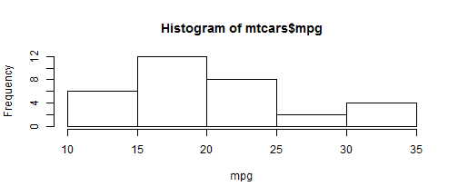
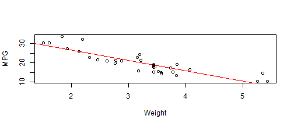

## Reproducible Pitch

1. The "Simple Demo" Shiny App is a very simplistic demonstration of Shiny
2. Although basic and generic, the app illustrates the power of Shiny as a means for reproducible demonstrations
3. The "Simple Demo" Shiny App can be effecively used as a teaching illustration

### What type of app do you expect for demonstration purposes?
* Would you prefer something elaborate with lots of bells and whistles?
* Or, would a simple illustration be preferable?

--- .class #id 

## Overview of ShinyApp

The location of the "Simle Demo" Shiny App is :
[http://johnmichaelr.shinyapps.io/SimpleDemo](http://johnmichaelr.shinyapps.io/SimpleDemo)


<p>Purpose of the "Simple Demo" application is to illustrate the ease and simplicity of generating a Histogram with the "mtcars" dataset. The user can select any attribute from the mtcars dataset and a histogram will automatically display based upon the user attribute selection.</p>

### Example of output provided to user

```r
library(datasets)

hist(mtcars$mpg, xlab="mpg")
```

 

```r
# close the plot
dev.off()
```

```
## null device 
##           1
```

--- .class #id 

## Future Version of "Simple Demo"

<p>Future versions of the Simple Demo will include dynamic selection of a dataset from the "datasets" library. Another option is to include the linear model plot of the dynamically selected dataset and outcome~predictor.</p>

### Example of a future version
<p>Demonstrate the functionality of a plot with a linear model applied.</p>
 


--- .class #id 

## Conclusion

<b>Keep It Simple</b>

* Simplicity keeps the focus on the tool
* User attention is drawn away when complexity is added

<p>
The "Simple Demo" is just what it says, very simple. A user or student can visualize the interactivity of Shiny without getting lost in too much complexity or visualizations. 
</p>

<em>The sole purpose of the app is to illustrate Shiny as:</em>

1. User Friendly Interactivity
2. Reproducible R code
3. Interactive R code
